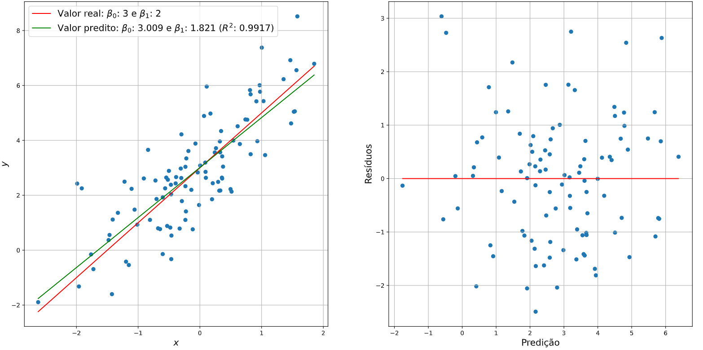
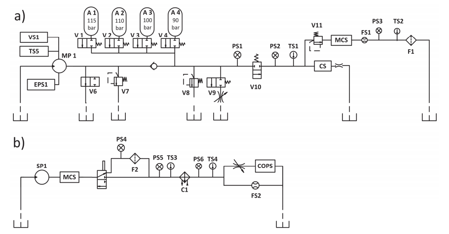

# Introdução à Confiabilidade de Sistemas

Repositório destinado à disciplina de Introdução à Confiabilidade de Sistemas, ofertada pelo Departamento de Engenharia Mecânica da Universidade Federal do Espírito Santo no primeiro semestre de 2021. Essa disciplina, em que fui monitor, tinha como objetivo discutir soluções baseadas em aprendizado de máquina e ciência de dados para problemas de engenharia. Nesta página, pode-se ter acesso aos problemas resolvidos e apresentados por mim durante as aulas das quais participei.

## *Statistical Learning*
Este *notebook* é destinado à solução da lista de exercícios sobre Statistical Learning, passada durante as aulas da disciplina e baseada na apresenação sobre o tema, realizada pelo [Leandro Turi](https://github.com/leandrofturi). O objetivo desta atividade é criar um conjunto de dados artificial e realizar algumas regressões lineares. O Jupyter Notebook pode ser acessado diretamente pelo repositório ou pelo [link](https://williamlhomem.github.io/ConfSist/statslearning.html).

## *Pump Sensor Dataset*
O *notebook* intitulado pumpsensor.ipynb contém a solução de um problema de identificação de anomalia de um sistema de distribuição de água por meio do registro dos sensores contidos na planta. Para resolver o referido problema, utilizou-se o conjunto de dados [*Pump Sensor Dataset*](https://www.kaggle.com/nphantawee/pump-sensor-data), que contém informação de uma planta durante um ano de funcionamento. O objetivo deste notebook é indicar as etapas básicas para a solução da questão mencionada, a partir de metodologias relacionadas a ciência de dados e aprendizado de máquina, abordando o assunto de forma mais didática. O Jupyter Notebook pode ser acessado diretamente pelo repositório ou pelo [link](https://williamlhomem.github.io/ConfSist/pumpsensor.html).

## *Hydraulic Systems Dataset*
O *notebook* hydro.ipynb apresenta a solução de um problema de monitoramento baseado na condição de uma bancada hidráulica constituída de dois sistemas: um primário de trabalho e um de refrigeração e filtragem. O objetivo dessa seção do portifólio é apresentar o desenvolvimento de um projeto que simule um problema real. Para tanto, além das etapas típicas da ciência de dados, uma situação hipotética foi levantada para que fosse possível analisar uma métrica de negócio. O Jupyter Notebook pode ser acessado diretamente pelo repositório ou pelo [link](https://williamlhomem.github.io/ConfSist/hydro.html).

O *dataset* utilizado para a criação de um modelo de aprendizado de máquina, denominado de *Hydraulic Systems Dataset*, pode ser acessado na [UCI](https://archive.ics.uci.edu/ml/datasets/Condition+monitoring+of+hydraulic+systems). O modelo criado foi capaz de prever a condição do trocador de calor, localizado no sistema resfriamento e filtragem, com uma métrica $`F_1`$ média de 99,33\%, garantindo uma redução de 44% no custo de manutenção e substituição do equipamento.

Fonte: Helwig, Pignanelli e Schütze, 2015
