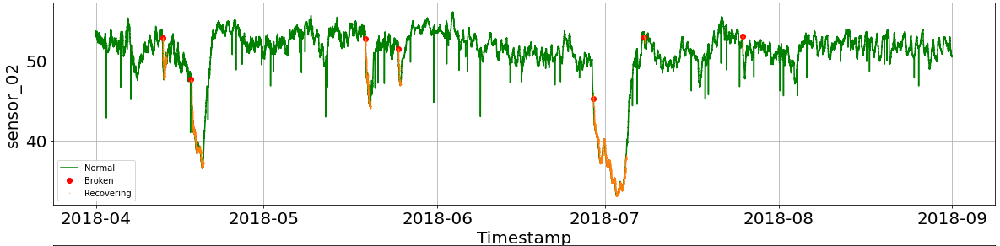

# Introdução à Confiabilidade de Sistemas

Repositório destinado à disciplina de Introdução à Confiabilidade de Sistemas, ofertada pelo Departamento de Engenharia Mecânica da Universidade Federal do Espírito Santo no primeiro semestre de 2021. Essa disciplina, em que fui monitor, tinha como objetivo discutir soluções baseadas em aprendizado de máquina e ciência de dados para problemas de engenharia. Nesta página, pode-se ter acesso aos problemas resolvidos e apresentados por mim durante as aulas das quais participei.

## *Statistical Learning*
Este *notebook* é destinado à solução da lista de exercícios sobre Statistical Learning, passada durante as aulas da disciplina e baseada na apresenação sobre o tema, realizada pelo [Leandro Turi](https://github.com/leandrofturi). O objetivo desta atividade é criar um conjunto de dados artificial e realizar algumas regressões lineares.

## *Pump Sensor Dataset*
O *notebook* intitulado pumpsensor.ipynb contém a solução de um problema de identificação de anomalia de um sistema de distribuição de água por meio do registro dos sensores contidos na planta. Para resolver o referido problema, utilizou-se o conjunto de dados [*Pump Sensor Dataset*](https://www.kaggle.com/nphantawee/pump-sensor-data), que contém informação de uma planta durante um ano de funcionamento. O objetivo deste notebook é indicar as etapas básicas para a solução da questão mencionada, a partir de metodologias relacionadas a ciência de dados e aprendizado de máquina, abordando o assunto de forma mais didática.

